# [RFC] Twilio Silent Network Auth (SNA) Integration

**Author:** [Zhengli Sun](mailto:zhengli.sun@doordash.com)  
**Created:** Dec 2025  
**Last updated:** Dec 2025  
**Status:** Draft

---

## Executive Summary

This RFC proposes integrating Twilio's Silent Network Auth (SNA) into Deliveroo's login flows to enable frictionless phone number verification. Unlike traditional SMS OTP which requires users to wait for and enter a code, SNA verifies phone numbers directly with mobile carriers without any user action.

> **Scope**: This RFC focuses on **existing user login only**. New user signup is out of scope for the initial implementation.

---

## 1. What is Silent Network Auth?

SNA (Silent Network Auth) is a carrier-based verification method that:
- Verifies a user's phone number possession directly with the mobile carrier
- Requires **no user interaction** (no code entry)
- Works only on **cellular data** (not Wi-Fi)
- Completes verification in **~4 seconds**
- Falls back to SMS OTP if unavailable

### How It Works (Simplified)
```
1. Backend initiates SNA verification → Twilio returns SNA URL
2. Mobile app invokes SNA URL (via cellular data)
3. Carrier verifies phone number → Twilio receives result
4. Backend checks verification status → Success/Failure
```

---

## 2. Why?

### Goals
- **Reduce friction**: Eliminate wait time and manual code entry for SMS OTP
- **Improve conversion**: Faster login/signup should improve user growth
- **Maintain security**: Carrier-based verification is secure and non-spoofable

### Similar Implementation: DoorDash
DoorDash implemented similar functionality using Sinch Seamless Verification:
- Reported reduced friction in login/signup flows
- Successfully integrated with fallback to SMS OTP
- Used SDK-based approach on mobile clients

---

## 3. High-Level Architecture

### Current SMS OTP Flow
```
User enters phone → co-accounts → Sphinx (SMS) → User enters code → orderweb validates
```

### Proposed SNA Flow
```
User enters phone → co-accounts → Sphinx → Twilio SNA → Mobile invokes URL → Sphinx checks status → co-accounts → orderweb
                                                ↓
                                         [Fallback to SMS OTP if SNA fails]
```

### Key Components Affected

| Component | Changes Required |
|-----------|------------------|
| **Sphinx** | New Twilio SNA integration: initiate/check SNA verification |
| **co-accounts (Go)** | Call Sphinx for SNA (similar to existing SMS OTP flow) |
| **Mobile Apps (iOS/Android)** | Invoke SNA URL via cellular, handle pre-checks |
| **orderweb (Rails)** | Minimal changes - accepts verified sessions |

---

## 4. How Existing Flows Change

### 4.1 Current: Existing User Login via SMS OTP
```
1. User enters email → co-accounts POST /check-email
2. User selects "Send code via SMS"
3. co-accounts → Sphinx: send SMS OTP
4. User receives SMS, enters code
5. orderweb validates code via Sphinx
6. User logged in
```

> **Note on Login Options**: Using phone number as a primary login option is currently being built. For this project, we proceed with the assumption that **both email-first and phone-first login options will co-exist in production** for a certain period of time. 

### 4.2 Proposed: Existing User Login via Email (with SNA enhancement)

This flow maintains the current email-first pattern but immediately kicks off SNA verification when the user taps "Continue".

```
1. User enters email
2. User taps "Continue"
3. App shows loading state on button ("Verifying...") - NOT the OTP entry screen
4. App → co-accounts: POST /request-login (email, sna=true)
5. co-accounts looks up phone number associated with email
6. co-accounts → Sphinx → Twilio: Start SNA verification using account's phone number
7. co-accounts → App: Returns { sna_url, verification_sid }
8. App invokes SNA URL via cellular data (background HTTP request)
9. App waits for SNA URL response (success/failure) - typically ~4 sec
10. App → co-accounts: POST /sna/verify { verification_sid, sna_result }
11. co-accounts → Sphinx → Twilio: Check verification status (confirm)
12. If APPROVED → co-accounts creates session → User logged in
    If FAILED → App transitions to OTP entry screen → Fallback to SMS OTP flow
```

### 4.3 Proposed: Existing User Login via Phone Number (with SNA)

This flow uses phone number as the primary identifier, enabling the most direct path to SNA verification.

```
1. User enters phone number
2. User taps "Continue"
3. App shows loading state on button ("Verifying...") - NOT the OTP entry screen
4. App → co-accounts: POST /request-login (with sna=true)
5. co-accounts → Sphinx → Twilio: Start SNA verification
6. co-accounts → App: Returns { sna_url, verification_sid }
7. App invokes SNA URL via cellular data (background HTTP request)
8. App waits for SNA URL response (success/failure) - typically ~4 sec
9. App → co-accounts: POST /sna/verify { verification_sid, sna_result }
10. co-accounts → Sphinx → Twilio: Check verification status (confirm)
11. If APPROVED → co-accounts creates session → User logged in
    If FAILED → App transitions to OTP entry screen → Fallback to SMS OTP flow
```

**Key UX Point**: User sees a **loading button** (not OTP screen) while SNA is attempted. Only if SNA fails do they see the OTP entry screen. This approach is similar to DoorDash's "loading button UI" pattern.

### UX Flow (Loading Button Pattern)

```mermaid
flowchart TD
    A[📱 Phone Entry Screen<br/>Enter phone number<br/>+44 7857 166752] -->|Tap Continue| B[📱 Loading State<br/>⟳ Verifying...<br/>Button disabled]
    
    B -->|"< 5 seconds"| C{SNA Result}
    
    C -->|Success| D[✅ Welcome back!<br/>Verified<br/>User logged in]
    C -->|Failed/Timeout| E[📱 OTP Entry Screen<br/>Enter the code we sent<br/>_ _ _ _]
    
    E -->|Enter code| F[✅ Verified<br/>User logged in]
    
    style A fill:#e3f2fd
    style B fill:#fff3e0
    style C fill:#f5f5f5
    style D fill:#e8f5e9
    style E fill:#fce4ec
    style F fill:#e8f5e9
```



### Timeout Handling

- **Timeout**: 5 seconds (configurable)
- If SNA doesn't complete within timeout → assume failure → fallback to SMS OTP
- Prevents user from waiting indefinitely

### Sequence Diagram


---

## 5. Technical Implementation


### 5.1 Sphinx Changes

Sphinx will integrate with Twilio's Verify API to support SNA as a new verification channel.

**New Twilio SNA Integration:**
```go
// Start SNA verification
func (c *TwilioClient) StartSNAVerification(phoneNumber, region string) (*SNAResponse, error) {
    // POST to Twilio Verify API with channel=sna
    // Uses region-specific endpoint (e.g., IE1 for UK)
    // Returns: verification_sid, sna_url
}

// Check verification status
func (c *TwilioClient) CheckSNAStatus(verificationSID, phoneNumber string) (*StatusResponse, error) {
    // POST to Twilio Verification Check API
    // Returns: status (approved/pending/failed), error_codes
}
```

**New Sphinx Endpoints:**
```
POST /sna/start
Request:
{
  "phone_number": "+447857166752",
  "region": "IE1"
}

Response:
{
  "verification_sid": "VExxxxx",
  "sna_url": "https://mi.dnlsrv.com/..."
}
```

```
POST /sna/check
Request:
{
  "verification_sid": "VExxxxx",
  "phone_number": "+447857166752"
}

Response:
{
  "status": "approved" | "pending" | "failed",
  "error_code": 60519  // if failed
}
```

### 5.2 co-accounts Changes

co-accounts will call Sphinx for SNA verification (similar to existing SMS OTP flow).

**New/Modified Endpoints:**

```
POST /request-login
Request:
{
  "phone_number": "+447857166752",
  "primary_mechanism": "sna",  // or "sms" for fallback
  "device_context": {
    "is_cellular": true,
    "is_wifi": false,
    "platform": "ios"
  }
}

Response (SNA):
{
  "verification_sid": "VExxxxx",
  "sna_url": "https://mi.dnlsrv.com/...",
  "mechanism": "sna",
  "timeout_seconds": 10
}

Response (SMS fallback):
{
  "mechanism": "sms",
  "contact": "+44***166752"
}
```

```
POST /sna/verify
Request:
{
  "verification_sid": "VExxxxx",
  "phone_number": "+447857166752",
  "sna_client_result": "success" | "failure" | "timeout"
}

Response:
{
  "status": "approved" | "pending" | "failed",
  "error_code": 60519,  // if failed
  "fallback_to": "sms"  // if failed
}
```

### 5.3 Mobile App Changes

**Pre-checks before SNA (determines if SNA is attempted):**
```swift
// iOS example
func canAttemptSNA() -> Bool {
    return !isWiFiConnected() &&
           isCellularDataEnabled() &&
           !isVPNActive() &&
           !isPrivateRelayEnabled()
}
```

**Login Flow (Pseudocode):**
```swift
func onContinueTapped(phoneNumber: String) {
    // 1. Show loading screen
    showLoadingScreen("Verifying your phone...")
    
    // 2. Check if SNA is possible
    let mechanism = canAttemptSNA() ? "sna" : "sms"
    
    // 3. Request login
    let response = await api.requestLogin(
        phoneNumber: phoneNumber,
        mechanism: mechanism,
        deviceContext: getDeviceContext()
    )
    
    if response.mechanism == "sna" {
        // 4. Invoke SNA URL
        let snaResult = await invokeSNAUrl(response.snaUrl)
        
        // 5. Verify with backend
        let verifyResponse = await api.verifySNA(
            verificationSid: response.verificationSid,
            snaResult: snaResult
        )
        
        if verifyResponse.status == "approved" {
            // 6a. Success - user logged in
            navigateToHome()
        } else {
            // 6b. Failed - fallback to SMS OTP
            await api.requestLogin(phoneNumber, mechanism: "sms")
            showOTPEntryScreen()
        }
    } else {
        // SMS flow - show OTP entry screen directly
        showOTPEntryScreen()
    }
}

func invokeSNAUrl(_ url: String) async -> String {
    // Make HTTP GET request via cellular
    // This triggers carrier verification
    do {
        let response = await URLSession.shared.data(from: URL(string: url)!)
        return "success"
    } catch {
        return "failure"
    }
}
```

**Key Points:**
- App decides SNA vs SMS based on device state (Wi-Fi, VPN, etc.)
- App invokes SNA URL and waits for response (~4 sec)
- App tells backend the result, backend confirms with Sphinx → Twilio
- On SNA failure, app seamlessly transitions to OTP screen

### 5.4 Twilio Integration

#### 5.4.1 Service Configuration (Region-Specific)

Twilio SNA requires region-specific configuration. For UK phone numbers, we **must use the IE1 (Dublin) region**.

| Country | Twilio Region | API Endpoint |
|---------|---------------|--------------|
| UK (+44) | IE1 (Dublin) | `verify.dublin.ie1.twilio.com` |
| US (+1) | US1 (Default) | `verify.twilio.com` |
| AU (+61) | AU1 (Sydney) | `verify.sydney.au1.twilio.com` |

**Setup Requirements:**
1. **Create a new Verify Service** specifically for SNA in the IE1 region
   - Existing SMS OTP services cannot be reused for SNA
   - Service must be configured with `channel: sna` enabled
   - See: [Twilio Verify with Regions](https://www.twilio.com/docs/verify/using-verify-silent-network-auth-with-twilio-regions)

2. **Region-specific credentials**
   - IE1 region requires separate API credentials
   - Account SID and Auth Token must be provisioned for IE1

3. **Service configuration options**
   - Friendly name: e.g., `deliveroo-sna-uk`
   - Code length: N/A for SNA (no OTP code)
   - Supported channels: `sna` (with `sms` fallback)

#### 5.4.2 Carrier Approval

SNA requires approval from mobile carriers before production use. Carrier approval can take **2-4 weeks** depending on carrier (UK carriers: EE, Vodafone, O2, Three).

#### 5.4.3 Cost Estimation

| Item | Cost (USD) | Notes |
|------|------------|-------|
| **SNA verification (successful)** | ~$0.05 per verification | Varies by country |
| **SNA verification (failed)** | ~$0.01 per attempt | Carrier lookup fee |
| **SMS OTP (fallback)** | ~$0.05-0.08 per SMS | Current cost baseline |

**Cost Considerations:**
- SNA cost is comparable to SMS OTP, but with better UX
- Failed SNA attempts still incur a small carrier lookup fee
- High SNA success rate = cost savings (no SMS fallback needed)
- Expected SNA success rate: **60-80%** (depends on cellular/Wi-Fi mix)

**Volume Estimates (TBD):**
| Metric | Estimate |
|--------|----------|
| Monthly logins (UK) | X |
| Expected SNA attempts | X |
| Expected SNA success rate | 60-80% |
| Estimated monthly SNA cost | $X |

---

## 6. Rollout Strategy

### 6.1 Feature Flags

SNA will be rolled out behind feature flags in both frontend and backend to allow controlled experimentation and quick rollback.

| Flag | Location | Description | Default |
|------|----------|-------------|---------|
| `sna_enabled` | Backend (co-accounts) | Master kill switch for SNA | `false` |
| `sna_eligible_countries` | Backend (co-accounts) | Countries where SNA is enabled | `[]` |
| `sna_rollout_percentage` | Backend (co-accounts) | % of eligible users to attempt SNA | `0` |
| `sna_ui_enabled` | Frontend (iOS/Android) | Show SNA loading UI vs immediate OTP | `false` |

### 6.2 Rollout Phases

| Phase | Scope | Success Criteria | Duration |
|-------|-------|------------------|----------|
| **1. Internal testing** | Employees only | Verify E2E flow works | 1 week |
| **2. Closed beta** | 1% of UK users | >50% SNA success rate, no critical bugs | a few days |
| **3. A/B Experiment** | 50% (?) of UK users | Stable success rate, positive metrics | 2 weeks |
| **4. Full rollout (UK)** | 100% of UK users | N/A | Ongoing |
| **5. Expand to other markets** | IE, AU, etc. | Per-market evaluation | TBD |

### 6.3 Measuring Metrics

| Metric | Target | How to Measure |
|--------|--------|----------------|
| SNA success rate | TBA | Successful SNA / Total SNA attempts |
| SNA Time to login | <5 seconds (SNA path) | P50/P95 latency |
| Login completion rate improvement | >0% | Compare SNA vs SMS OTP cohorts |

---

## 7. Engineering Effort Estimate

### 7.1 By Component

| Component | Team | Effort | Description |
|-----------|------|--------|-------------|
| **Sphinx** | Platform | 2 weeks | Twilio SNA client, new endpoints, region config |
| **co-accounts** | Cx Growth | 1 week | Call Sphinx for SNA, handle responses |
| **iOS App** | Mobile | 2 weeks | SNA URL invocation, pre-checks, UI states |
| **Android App** | Mobile | 2 weeks | SNA URL invocation, pre-checks, UI states |
| **Integration testing** | All | 1 week | E2E testing, carrier testing |

**Total estimated duration: BE: 3 weeks; Android: 2 weeks; iOS: 2 weeks**

---

## References

- [Twilio SNA Testing Guide](https://www.twilio.com/docs/verify/sna-testing-guide)
- [Twilio SNA with Regions](https://www.twilio.com/docs/verify/using-verify-silent-network-auth-with-twilio-regions)
- [DoorDash Sinch Seamless Verification RFC](./[RFC]%20Sinch%20Seamless%20Verification%20.md)
- [Deliveroo Login/Sign-up Flows Audit](./Deliveroo%20Login_Sign-up%20Flows%20Audit.md)
- [SNA Playground (Testing Code)](https://github.com/zhengli-sun/sna-playground)

